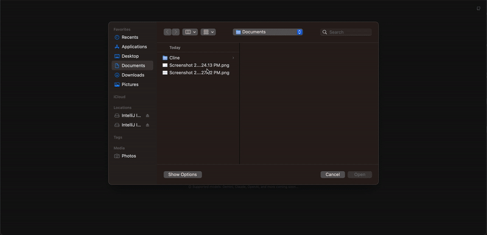

# [drift.codes](https://drift.codes)

Drift is an proof-of-concept AI Agent tool that can code entire TailwindCSS pages for you using Google Gemini's Vision capabilities. This project is currently in V0, see the Roadmap to see what's next.

## Why can I trust you with my API Key?

**Open-source:** Drift.codes is 100% open source, meaning there are no shenanigans or hidden code.  
You can view the source code on GitHub or run it yourself.

**Free key:** This 'free-tier' API Key is granted [1,500 requests per day](https://ai.google.dev/pricing#1_5flash)!  
There will be no charges made to your account.

**Secure key:** Your Gemini API key is isolated to Gemini. It cannot access your Google account in any way.

This is exact same as placing your API key into Cline, Bolt.diy or other open-source tools.

## How to use

1. Upload an image of a website or a design
2. Wait for initial code to be generated
3. Click on a component to select it
4. Provide feedback on the changes you want to make
5. The updates will be automatically inserted into the code

## Supported models

- Gemini: Gemini 2.0 Flash
- OpenAI: GPT-4o
- Anthropic: Claude 3.5 Sonnet

## Limitations

- Icons/Images cannot be seen by the screenshotting library
- - Html2Canvas does not support rending cross-origin images in iframes

- AI responses are not perfect, you should expect to make some manual changes

## How it works

Drift.codes uses an AST-based replacement approach to apply changes to the code.
This proof-of-concept transform uses a hidden 'data-ast-id' attribute to identify the nodes to be replaced.
This keeps code-changes small and better prompting for the AI model.

Simply check 'Select Specific Node' to target your AI prompts to only that node.

## Roadmap

V0: Create demo website to gather feedback from users.

- While facing limitations, this is a simply proof-of-concept for getting feedback
- Add more model support: LLama, Mistral
- Better prompting, ex: Generate component list -> Identity bounding boxes -> Create hierarchy of components

V1: Move into VS Code extension with browser-integration to capture real screenshots

- This will allow Drift.codes to capture icons/images
- This provides real-world images with proper aspect ratios, etc.

V2: Support React-ASTs

- This is the most complex step towards a full-fledged AI Agent
- The current project handles DOM-ASTs by ID-ing each node. In React this will need special development hooks to 'ID' each component
- This will start with single-file support, but once Vector indexings is added, it will be able to handle entire projects
- Maybe integration with Cline?

## License

MIT License
